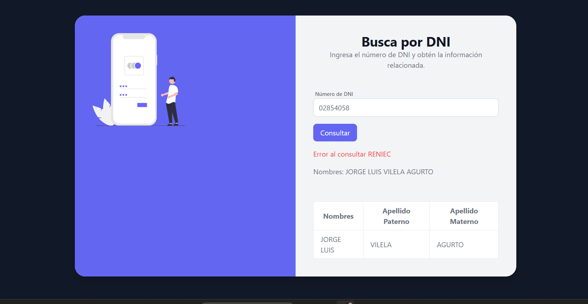

# Welcome - Api Reniec 
Hola que tal, recuerdo cuando estaba en mi segundo año de carrera uno de mis docentes nos asigno un proyecto basico, consistia en conectar mi primera API de RENIEC, La app tenia como objetivo mostrar nombres completos siempre y cuando se pase como parametro el numero de DNI del usuario.
(DNI => 8 digitos)

# Lenguajes o Frameworks 
Vue - JS - Tailwind 

# Objetivo 
Hacer busqueda en la bd de reniec por nro de DNI y Obtener Nombres completos.

# Clonar Repo

1) git clone https://github.com/wilderTorres18/ReniecVue.git

|  #  | Project                                                                                                                     | Live Demo                                                                         |
| :-: | --------------------------------------------------------------------------------------------------------------------------- | --------------------------------------------------------------------------------- |
| 01  | [Reniec Vue]                                                                                                                | [Live Demo](https://reniec-vue-git-master-wilder-s-projects.vercel.app/)               |

## Capturas de pantalla:

